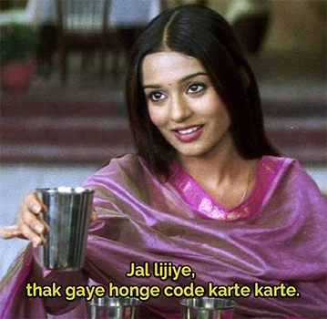

# Jal_Lijiye
Chrome extension that keep you reminded to drink water in every 20 mins

## How to Install ?
1. Clone or download this repository.
2. Navigate to chrome://extensions/
3. Click on 'Toggle the developer mode'.
4. Click on 'Load Unpacked'
5. Select the complete folder which you cloned or downloaded in the first step.
6. Now just click on the extenstion and it will play sound after every 20 minutes.

## Tech Stack
- HTML
- CSS
- JavaScript
